# 🚀 Crypto MLOps Dashboard

**Live Demo:** [https://crypto.gokuladethya.uk/](https://crypto.gokuladethya.uk/)
**Preview:** [https://crypto.gokuladethya.uk/howitworks](https://crypto.gokuladethya.uk/howitworks)

**Project:** Crypto MLOps Dashboard — Real-time BTC/USDT price and sentiment prediction.

For installation instructions, see [INSTALL.md](install.md).

---

## 🏗️ Project Overview

Crypto MLOps Dashboard is a fully automated **MLOps pipeline** that predicts crypto trading signals (`Buy`, `Hold`, `Sell`) using:

* **Time-series price data** from Binance API
* **Textual sentiment data** from Yahoo Finance (scraped using **Playwright** & **BeautifulSoup4**)

It combines **reinforcement-tuned FinBERT**, **LightGBM**, and **TST models**, with fully automated training, inference, and monitoring across **Kubernetes**.

**Stack:** Python, FastAPI, Kafka, Airflow, MLflow, ONNX, Prometheus + Grafana, Vast.ai, PostgreSQL, S3, Nginx, Cert-Manager

---

## 🖼️ Orchestration Overview

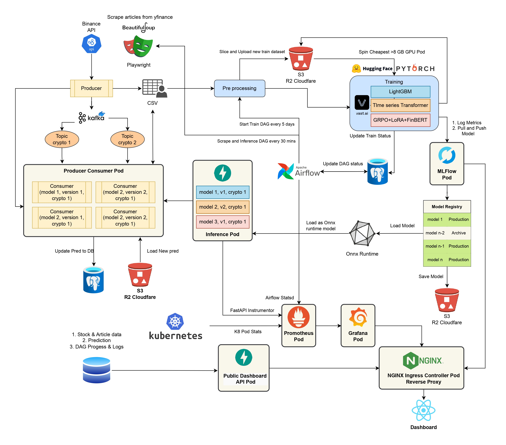

---

## 📊 Label Generation

### 1️⃣ Time-Series Labels

* Derived from BTC/USDT price trends
* Assigns `Buy`, `Hold`, or `Sell` based on percentage price change

### 2️⃣ Text-Based Labels

* Scraped articles analyzed for **average price change over 12 hours**
* Labels `Buy`, `Hold`, or `Sell` correspond to market reaction

---

## 🏋️‍♂️ Model Training

### Time-Series

* **TST (Temporal Signal Transformer)**
* **LightGBM**

### Text-Based (TRL-FinBERT + GRPO + LoRA)

* Fine-tunes **FinBERT** using **Gradient-Regularized Policy Optimization (GRPO)**
* Uses **LoRA adapters** for parameter-efficient training
* Treats financial sentiment classification as **RL problem** with price-change reward signals

**Pseudo Algorithm:**

```python
logits_old = theta_old(texts)
probs_old = softmax(logits_old)
sampled_actions = sample_actions(probs_old, group_size)

rewards = compute_rewards(sampled_actions, true_labels, price_changes, normalizer)

logits_new = policy(texts)
logp_new = log_probs_from_logits(logits_new, sampled_actions)
logp_old = log_probs_from_logits(logits_old, sampled_actions)

advantages = rewards - group_mean(rewards)

ratio = exp(logp_new - logp_old)
loss_surrogate = -mean(min(ratio * advantages,
                           clip(ratio, 1-clip_eps, 1+clip_eps) * advantages))

kl_loss = KL(policy(texts), reference_model(texts))
loss = loss_surrogate + kl_coef * kl_loss
```

---

## 🗄️ Databases

| DB                  | Purpose                                  |
| ------------------- | ---------------------------------------- |
| Predictions DB      | Latest crypto prices & model predictions |
| Vast.ai Training DB | Tracks GPU pod training status           |
| Airflow DB          | DAG events & monitoring                  |
| MLflow PSQL         | Centralized model registry               |

---

## 🧱 Model Versioning

* Managed via **MLflow** (S3 backend)
* **v1:** Initial fixed model
* **v2 & v3:** Active production
* **10 archived models** retained
* **Public MLflow Viewer:** [https://mlflow.gokuladethya.uk/](https://mlflow.gokuladethya.uk/)

---

## ⚡ Model Inference (FastAPI)

* ONNX-compiled models served on **dedicated FastAPI pod**
* `/refresh` endpoint reloads models from MLflow dynamically
* Instrumented with **Prometheus + Grafana** monitoring
* Hosted behind **Nginx ingress**

---

## 🔄 End-to-End Orchestration

**Workflow:**

1. **Producer:** Fetches Binance data → Kafka topic
2. **Consumer:** Listens → inference → updates PostgreSQL (`model × version × currency`)
3. **Training:**

   * Slice last 6 months → S3
   * Spin Vast.ai GPU pod → train → log to MLflow
   * Upload model & predictions to S3
   * Airflow monitors pod status & enforces timeouts

**Post-Training Reconciliation:**

```text
1. Stop old consumers (x-v-2, x-v-3)
2. Pull new FastAPI models from MLflow (/refresh)
3. Rename local predictions (x-v-3 → x-v-2)
4. Start consumers for x-v-2
5. Download new predictions (x-v-3) from S3
6. Infer delta test data → push to PostgreSQL
7. Start consumers for x-v-3
8. Upload updated predictions to S3 (v2 & v3)
```

---

## 📰 TRL Orchestration

* Runs every **30 mins** for news scraping & inference
* Compiles ONNX if not cached
* Pushes predictions to PostgreSQL

---

## ☸️ Kubernetes Architecture

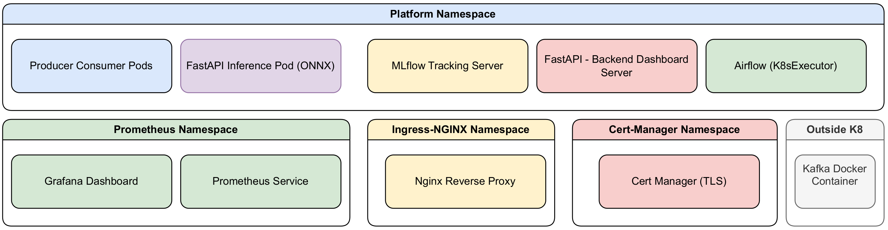

**Namespaces & Pods:**

* **platform:** MLflow, FastAPI, Dashboard backend, Producer-Consumer, Airflow
* **ingress-nginx:** Reverse proxy for endpoints
* **cert-manager:** TLS support
* **prometheus:** Prometheus + Grafana dashboards
* **Kafka (dockerized):** Separate persistent setup

**Grafana:** [https://grafana.gokuladethya.uk/](https://grafana.gokuladethya.uk/)

---

## 🖼️ Dashboard Screenshots

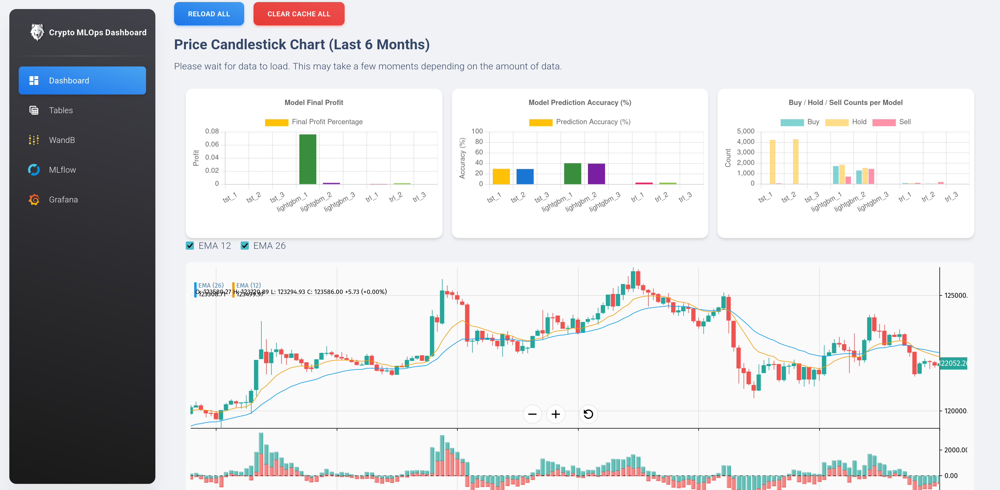
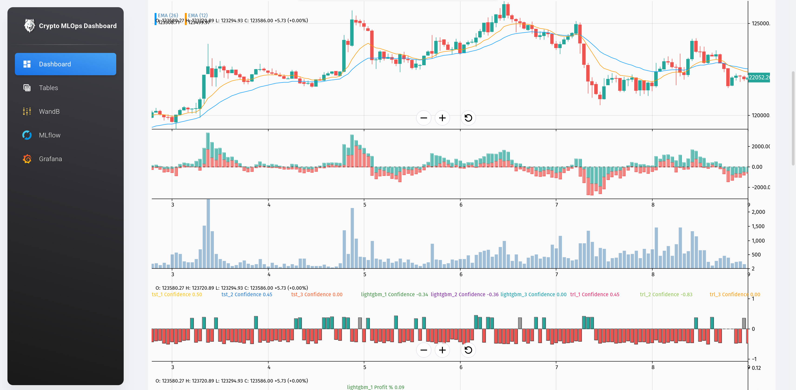
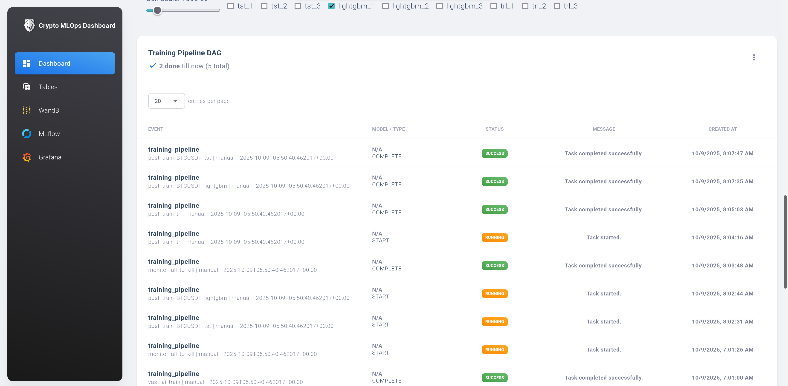
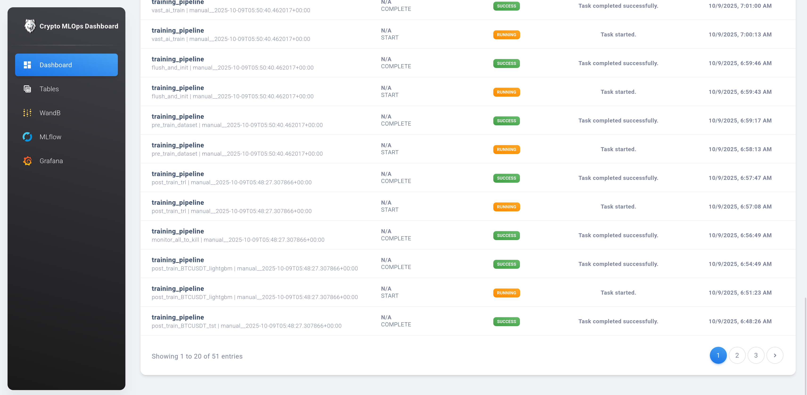
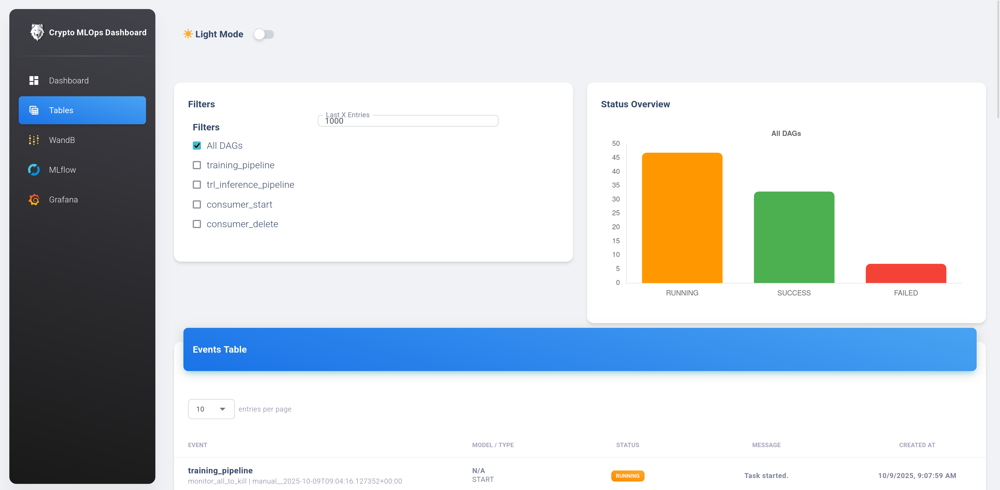
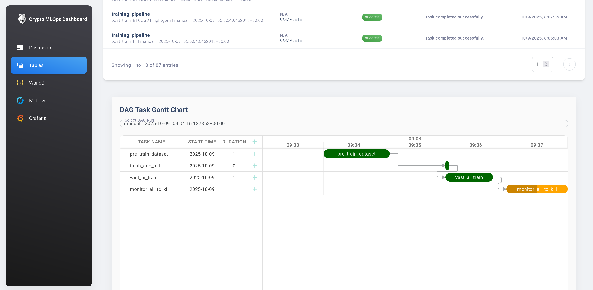
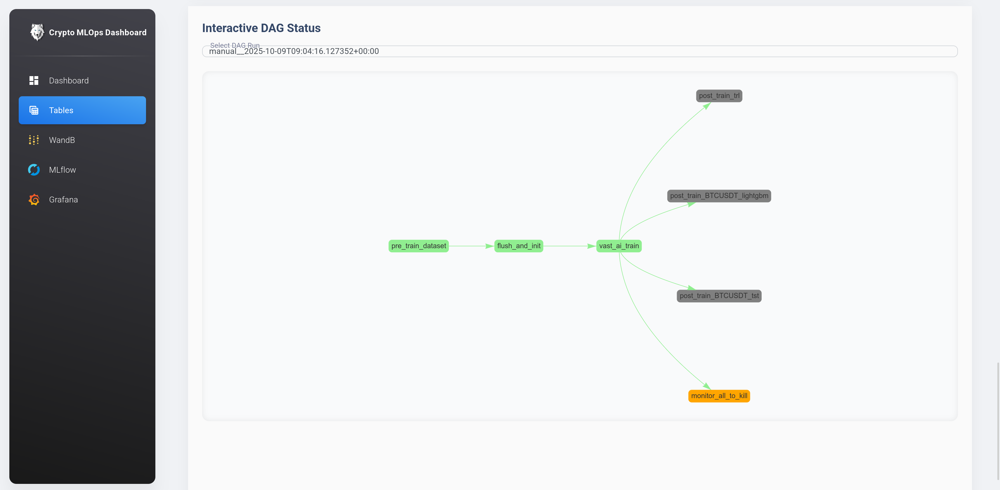
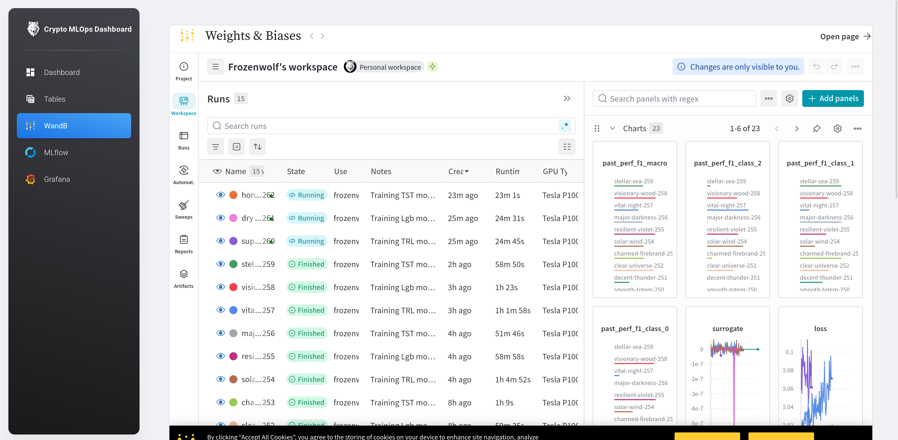

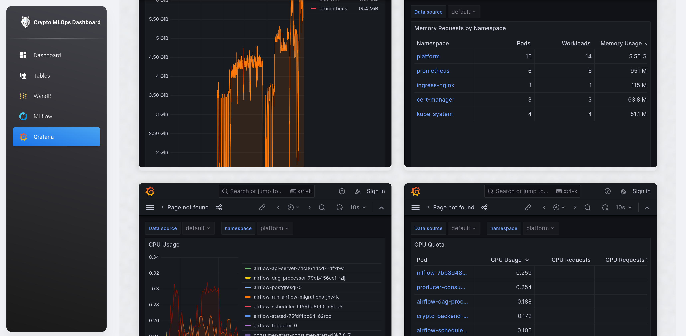
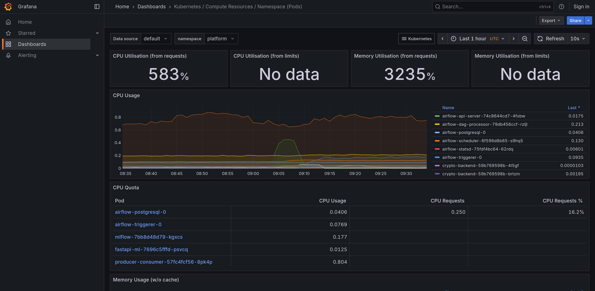
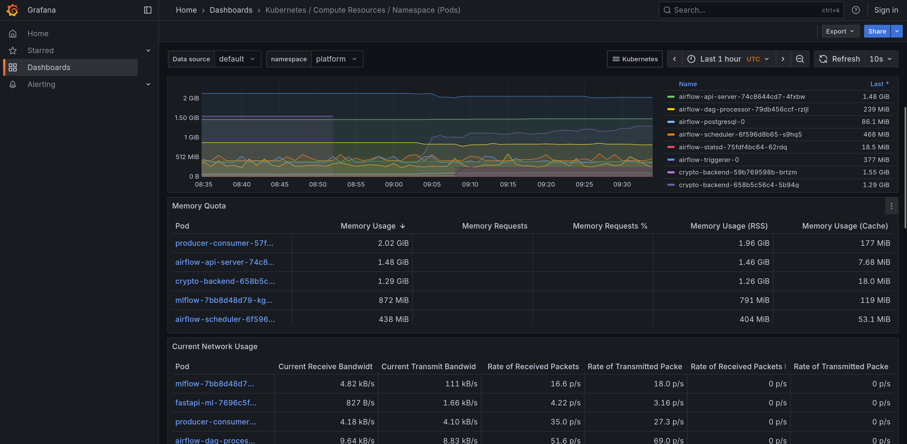
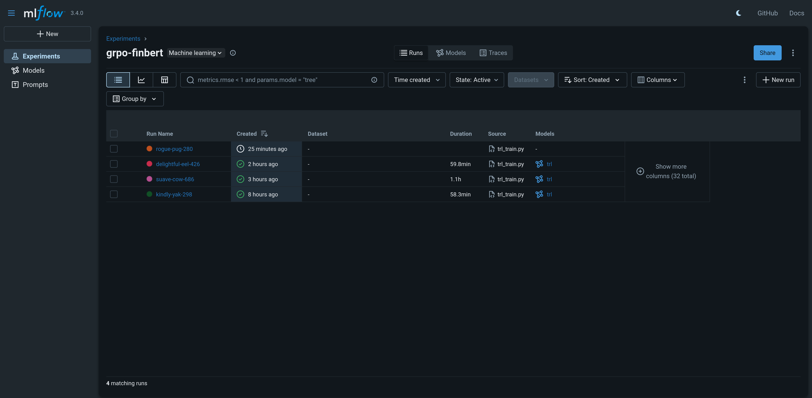
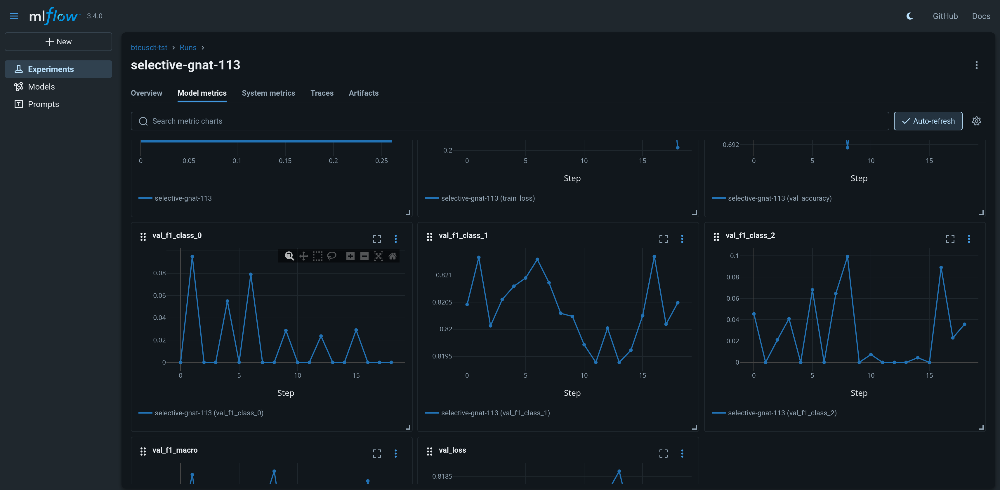
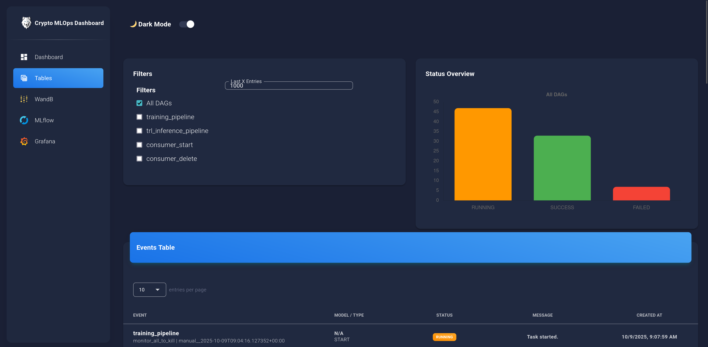
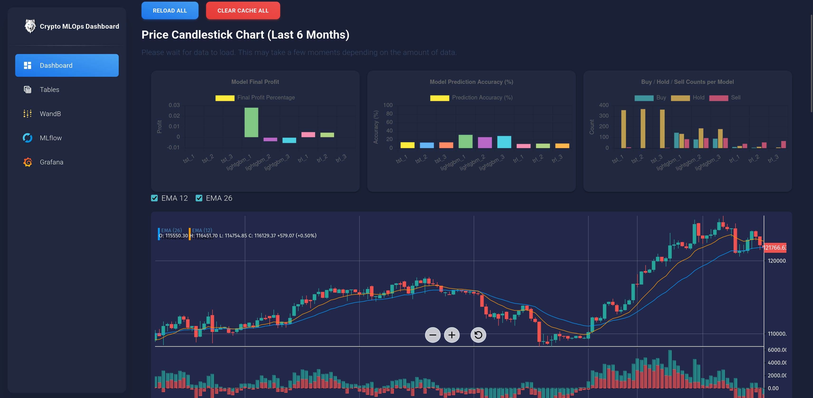

