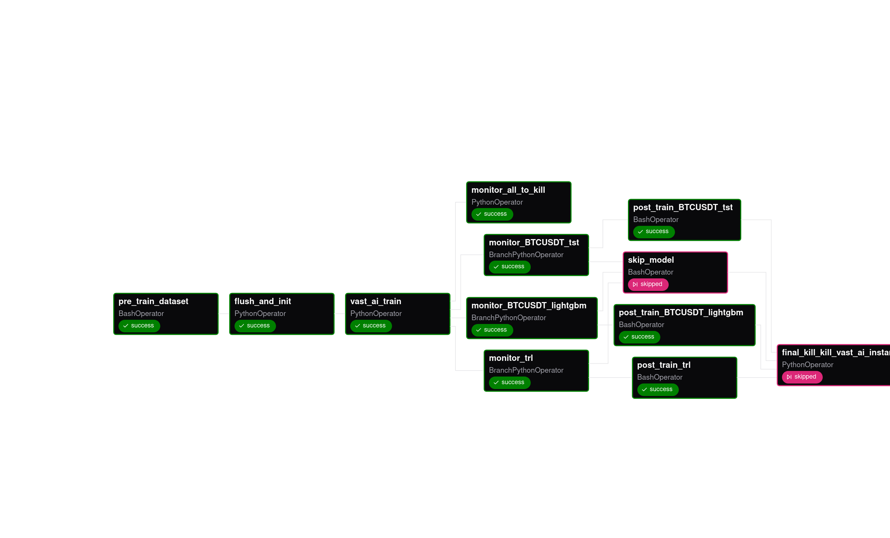

# 🚀 Crypto MLOps Dashboard

**Live Demo:** [https://crypto.gokuladethya.uk/](https://crypto.gokuladethya.uk/)
**Preview:** [https://crypto.gokuladethya.uk/howitworks](https://crypto.gokuladethya.uk/howitworks)

**Project:** Crypto MLOps Dashboard — Real-time BTC/USDT price and sentiment prediction.

**Dashboard Code:** [https://github.com/FrozenWolf-Cyber/crypto](https://github.com/FrozenWolf-Cyber/crypto)

For installation instructions, see [INSTALL.md](install.md).

---

## 🏗️ Project Overview

Crypto MLOps Dashboard is a fully automated **MLOps pipeline** that predicts crypto trading signals (`Buy`, `Hold`, `Sell`) using:

* **Time-series price data** from Binance API
* **Textual sentiment data** from Yahoo Finance (scraped using **Playwright** & **BeautifulSoup4**)

It combines **reinforcement-tuned FinBERT**, **LightGBM**, and **TST models**, with fully automated training, inference, and monitoring across **Kubernetes**.

**Stack:** Python, FastAPI, Kafka, Airflow, MLflow, ONNX, Prometheus + Grafana, Vast.ai, PostgreSQL, S3, Nginx, Cert-Manager

---

## 🖼️ Orchestration Overview


---

Here’s your **rephrased and properly formatted README section** version of that “Idea Overview” — written in Markdown, styled for GitHub readability, and preserving your technical depth:

---

## 🧠 Idea Overview

We scrape **article data**, **Bitcoin prices**, and other related statistics at regular intervals to power a continuous MLOps pipeline.
The system trains three core model types:

* **TRL (LLM Classifier for Articles)** — trained using *Gradient-Regularized Policy Optimization (GRPO)* to align textual sentiment with market reactions.
* **LightGBM** — trained on tabular, price-based features for short-term movement prediction.
* **Time Series Transformer (TST)** — processes temporal sequences to capture price trend dynamics.

Each model maintains **three active versions** to monitor **distribution shifts** and **performance degradation** over time.
All three versions of all three models (total of nine live predictions) are continuously updated and stored in **PostgreSQL**, which serves data to the analytics dashboard.

---

### ⚙️ Deployment & Architecture

The pipeline aims for **near-zero downtime**, **scalability**, and **rapid model refresh**.
For instance, if LightGBM completes retraining early, it can be deployed immediately without waiting for other models or disrupting ongoing inference.

To achieve this:

* **Kafka** is used for asynchronous producer-consumer message streaming.
* **S3-hosted MLflow** handles model registry, version tracking, and logging.
* **Hot-swapping** is performed as soon as a model finishes training, avoiding downtime.
* **Prometheus + Grafana** provide real-time observability for inference latency and system load.
* **Nginx Ingress Reverse Proxy** secures endpoints and routes traffic efficiently.
* **Airflow DAGs** orchestrate retraining, data updates, and deployment cycles.

Additionally, **historical predictions** are reconciled whenever a model version is updated to maintain backward consistency between inferences.

---

### ☸️ Why Kubernetes?

I adopted **Kubernetes (K8s)** primarily to experiment with **scalable training and deployment orchestration**, and to explore GPU-based pod scheduling.

The original design included connecting **Vast.ai nodes** as additional GPU-enabled workers in the same cluster, dynamically spinning up training pods through the **Kubernetes Operator** based on GPU VRAM availability.

However, this approach faced several challenges:

1. **VM Dependency** — Kubernetes requires VMs instead of lightweight instances, increasing startup time, instability, and cost.
2. **GPU Resource Scheduling** — The official **NVIDIA GPU plugin** only supports A/H-series GPUs, not cheaper consumer GPUs.
3. **Third-party plugins** — Existing GPU schedulers were unstable and often incompatible with mixed GPU environments.
4. **Custom Scheduler via Airflow** — Bypassing K8s GPU scheduling was possible but **cost-inefficient** and **complex to maintain**.

Despite these challenges, the system serves as a strong **experimental sandbox** for learning scalable MLOps principles — including distributed training, versioned deployment, and automated monitoring across heterogeneous infrastructure.

---


## Folder Structure

```bash
crypto-mlops
├── dags/
│   ├── cleanup_DAG.py                # training event cleanup
│   ├── DAG.py                        # model_training_pipeline: trains LightGBM, TST, TRL models every 5 days; includes consumer_start_dag (resume producer/consumer on startup) and delete_all_process (kill all producer/consumer)
│   └── trl_infer_Dag.py              # trl_inference_pipeline: scrapes past news data, compiles using trl_onnx_maker, performs inference
│
├── k8-setup/
│   ├── airflow-ingress.yaml          # reverse proxy for Airflow (TODO)
│   ├── backend.yaml                  # backend for crypto dashboard + reverse proxy
│   ├── cluster-issuer.yaml           # auto issues/renews TLS/SSL certs (HTTPS) in cluster
│   ├── fast-api.yaml                 # hosts model inference for consumer process, loads latest models from S3 + MLflow, exposes Prometheus hooks
│   ├── generate_secrets.py           # dynamically generates platform-secrets.yaml from OS env vars; assigns credentials for entire cluster
│   ├── grafana-config.yaml           # Grafana hosting configs
│   ├── grafaingress.yaml             # reverse proxy for Grafana
│   ├── kafka-service.yaml            # exposes Kafka to cluster pods
│   ├── kafka.yaml                    # external Docker-based Kafka (default Quixstream template)
│   ├── ml-flow.yaml                  # MLflow hosting pod + service exposure to other pods
│   ├── mlflow_bootstrap.py           # post-reverse-proxy script: updates admin creds, sets public view password, creates secret endpoint for VastAI logging
│   ├── mlflow-ingress.yaml           # reverse proxy for MLflow
│   ├── pod_template.yaml             # pod template for Airflow KubernetesExecutor tasks
│   ├── producer-consumer.yaml        # pod running producer and consumer outside Airflow
│   ├── pvc.yaml                      # PV/PVC claims for persistent storage
│   └── values.yaml                   # Airflow configuration values
│
├── utils/
│   ├── articles_runner/
│   │   ├── past_news_scrape.py       # news scraper using Playwright
│   │   └── scrape.py                 # scraping utilities; saves scraped news locally as CSV
│   │
│   ├── artifact_control/
│   │   ├── model_manager.py          # handles MLflow model logging, promotion, archival in S3 registry
│   │   └── s3_manager.py             # upload/download predictions, price data, etc.
│   │
│   ├── database/
│   │   ├── airflow_db.py             # training status DB updated by VastAI; monitored by training DAG
│   │   ├── db.py                     # handles CRUD ops on crypto prices, predictions, and articles
│   │   └── status_db.py              # DAG hook that logs each task’s status and errors
│   │
│   ├── dockerfile/
│   │   ├── backend.dockerfile        # FastAPI backend for crypto dashboard
│   │   ├── main.py                   # backend server entrypoint
│   │   ├── modelserve.dockerfile     # FastAPI model serving image
│   │   ├── producer_consumer.dockerfile # producer-consumer pod image
│   │   └── worker.dockerfile         # Airflow worker image
│   │
│   ├── producer_consumer/
│   │   ├── consumer_start.py         # resumes producer-consumer setup on pod restart/new setup
│   │   ├── consumer_utils.py         # handles read/write states for communication between independent processes and worker pods
│   │   ├── consumer.py               # consumer triggered per version/model/crypto; listens to topic, performs inference via FastAPI, pushes results to DB, self-deletes after completion
│   │   ├── job_handler.py            # creates producer/consumer by invoking scripts when job is received from worker
│   │   ├── kill_all.py               # kills all active producers and consumers
│   │   └── producer.py               # producer for each coin; pushes messages to topic and writes locally
│   │
│   ├── serve/
│   │   ├── fastapi_app.py            # FastAPI model server; supports model refresh from MLflow/S3; monitored by Prometheus
│   │   ├── trl_inference.py          # loads compiled ONNX models to perform inference
│   │   └── trl_onnx_maker.py         # detects new model pushes, compiles new ONNX models
│   │
│   ├── trainer/                      # training scripts; train_parallel.py triggers concurrent model training (LightGBM/TST/TRL) with early stopping and safe completion; updates status; performs post-train inference and S3 upload
│   │
│   └── utils/
│       ├── kill_vast_ai_instances.py # terminates all VastAI instances
│       ├── post_train_reconcile.py   # reconciles post-train predictions with DB/CSV; kills old consumers, spins new ones for updated model
│       ├── post_train_trl.py         # same as above, but for TRL model
│       ├── pre_train_dataset.py      # slices last 6 months’ data before training; pushes to S3 for VastAI pods
│       └── vast_ai_train.py          # selects budget-efficient VastAI pod; blacklists malformed pods

```
## 📊 Label Generation

### 1️⃣ Time-Series Labels

* Derived from BTC/USDT price trends
* Assigns `Buy`, `Hold`, or `Sell` based on percentage price change

### 2️⃣ Text-Based Labels

* Scraped articles analyzed for **average price change over 12 hours**
* Labels `Buy`, `Hold`, or `Sell` correspond to market reaction

---

## 🏋️‍♂️ Model Training

### Time-Series

* **TST (Temporal Signal Transformer)**
* **LightGBM**

### Text-Based (TRL-FinBERT + GRPO + LoRA)

* Fine-tunes **FinBERT** using **Gradient-Regularized Policy Optimization (GRPO)**
* Uses **LoRA adapters** for parameter-efficient training
* Treats financial sentiment classification as **RL problem** with price-change reward signals

**Pseudo Algorithm:**

```python
logits_old = theta_old(texts)
probs_old = softmax(logits_old)
sampled_actions = sample_actions(probs_old, group_size)

rewards = compute_rewards(sampled_actions, true_labels, price_changes, normalizer)

logits_new = policy(texts)
logp_new = log_probs_from_logits(logits_new, sampled_actions)
logp_old = log_probs_from_logits(logits_old, sampled_actions)

advantages = rewards - group_mean(rewards)

ratio = exp(logp_new - logp_old)
loss_surrogate = -mean(min(ratio * advantages,
                           clip(ratio, 1-clip_eps, 1+clip_eps) * advantages))

kl_loss = KL(policy(texts), reference_model(texts))
loss = loss_surrogate + kl_coef * kl_loss
```

---

## 🗄️ Databases

| DB                  | Purpose                                  |
| ------------------- | ---------------------------------------- |
| Predictions DB      | Latest crypto prices & model predictions |
| Vast.ai Training DB | Tracks GPU pod training status           |
| Airflow DB          | DAG events & monitoring                  |
| MLflow PSQL         | Centralized model registry               |

---

## 🧱 Model Versioning

* Managed via **MLflow** (S3 backend)
* **v1:** Initial fixed model
* **v2 & v3:** Active production
* **10 archived models** retained
* **Public MLflow Viewer:** [https://mlflow.gokuladethya.uk/](https://mlflow.gokuladethya.uk/)

---

## ⚡ Model Inference (FastAPI)

* ONNX-compiled models served on **dedicated FastAPI pod**
* `/refresh` endpoint reloads models from MLflow dynamically
* Instrumented with **Prometheus + Grafana** monitoring
* Hosted behind **Nginx ingress**

---

## 🔄 End-to-End Orchestration

**Workflow:**

1. **Producer:** Fetches Binance data → Kafka topic
2. **Consumer:** Listens → inference → updates PostgreSQL (`model × version × currency`)
3. **Training:**

   * Slice last 6 months → S3
   * Spin Vast.ai GPU pod → train → log to MLflow
   * Upload model & predictions to S3
   * Airflow monitors pod status & enforces timeouts

**Post-Training Reconciliation:**

```text
1. Stop old consumers (x-v-2, x-v-3)
2. Pull new FastAPI models from MLflow (/refresh)
3. Rename local predictions (x-v-3 → x-v-2)
4. Start consumers for x-v-2
5. Download new predictions (x-v-3) from S3
6. Infer delta test data → push to PostgreSQL
7. Start consumers for x-v-3
8. Upload updated predictions to S3 (v2 & v3)
```

---

## 📰 TRL Orchestration

* Runs every **30 mins** for news scraping & inference
* Compiles ONNX if not cached
* Pushes predictions to PostgreSQL

---

## ☸️ Kubernetes Architecture


**Namespaces & Pods:**

* **platform:** MLflow, FastAPI, Dashboard backend, Producer-Consumer, Airflow
* **ingress-nginx:** Reverse proxy for endpoints
* **cert-manager:** TLS support
* **prometheus:** Prometheus + Grafana dashboards
* **Kafka (dockerized):** Separate persistent setup

**Grafana:** [https://grafana.gokuladethya.uk/](https://grafana.gokuladethya.uk/)

## DAG:
Training Pipeline DAG:


---

## 🖼️ Dashboard Screenshots


